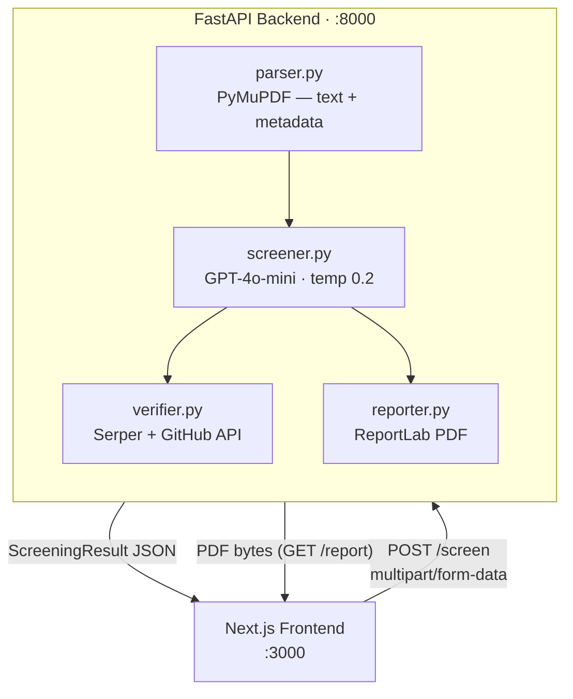

# AI Resume Screener

An end-to-end hiring tool that extracts text from PDF résumés, scores candidate fit against a job description using GPT-4o-mini, verifies GitHub profiles via the Serper search API and GitHub public API, and produces a downloadable PDF report. The frontend is a single-page Next.js app; the backend is a FastAPI service.

---

## Architecture



---

## Quick start

### 1 — Clone and configure

```bash
git clone <repo-url>
cd resume-screener
cp .env.example .env
# Edit .env and fill in:
#   OPENAI_API_KEY=sk-...
#   SERPER_API_KEY=...
```

### 2 — Backend

```bash
cd backend
python -m venv .venv
# Windows: .venv\Scripts\activate
# macOS/Linux: source .venv/bin/activate
pip install -r requirements.txt
uvicorn main:app --reload
# → http://localhost:8000
# → http://localhost:8000/docs  (Swagger UI)
```

### 3 — Frontend

```bash
cd frontend
npm install
npm run dev
# → http://localhost:3000
```

---

## API reference

### Screen a single PDF

```bash
curl -X POST http://localhost:8000/screen \
  -F "pdf_file=@/path/to/resume.pdf" \
  -F "job_description=We are looking for a senior Python engineer..."
```

### Screen from plain text (useful for testing)

```bash
curl -X POST http://localhost:8000/screen/text \
  -F "resume_text=Jane Doe, jane@example.com, 6 yrs Python..." \
  -F "job_description=Senior backend engineer role..." \
  -F "candidate_name=Jane Doe"
```

### Batch-screen multiple PDFs

```bash
curl -X POST http://localhost:8000/batch \
  -F "job_description=Senior Python engineer..." \
  -F "pdf_files=@alice.pdf" \
  -F "pdf_files=@bob.pdf" \
  -F "pdf_files=@charlie.pdf"
```

### Download a PDF report

```bash
# Candidate must have been screened in the current session first
curl -O -J http://localhost:8000/report/Jane%20Doe
```

---

## Running tests

```bash
# From the project root
pytest -v

# With coverage
pip install pytest-cov
pytest --cov=backend --cov-report=term-missing
```

---

## Makefile targets

| Target | What it does |
|---|---|
| `make install` | Install Python + Node deps |
| `make run-backend` | Start FastAPI with hot reload |
| `make run-frontend` | Start Next.js dev server |
| `make test` | Run pytest suite |
| `make lint` | Run ruff + tsc type-check |

---

## Portfolio notes

### Prompt engineering

The screening prompt in `prompts.py` does three things that most naive implementations skip:

1. **Scoring rules are inside the prompt, not just the schema.** The model is told `score 7–10 → recommendation must be "hire"`, etc. This reduces the cross-field inconsistency that would otherwise require repeated retries or post-hoc correction.

2. **`temperature=0.2`** rather than 0 or 1. Zero temperature can cause the model to over-confidently stick to surface-level keyword matching. 0.2 preserves structured determinism while allowing enough variation for the model to weigh nuanced signals.

3. **`response_format={"type": "json_object"}`** with an explicit instruction ("no markdown fences, no text before or after") is belt-and-suspenders: the API flag enforces JSON tokenisation, but the instruction primes the model's attention so it doesn't prepend a polite opener even in edge cases.

### Three-tier JSON recovery

`parse_llm_response` in `prompts.py` attempts three parses before failing:

1. Direct `json.loads` — handles the ideal case.
2. Strip markdown fences via regex — handles the most common failure mode (model wraps output in ` ```json ` despite instructions).
3. Brace-depth scan — finds the first complete `{…}` block character-by-character. This handles models that add a prose sentence before the object. A regex alternative would break on nested objects; the depth counter does not.

Each fallback is only tried if the previous one failed, so the happy path has zero regex overhead.

### Pydantic as a second validation layer

The `ScreeningResult` model in `models.py` repeats the scoring rules as Pydantic validators (`recommendation_aligns_with_score`). This means the same constraint is enforced at two points: inside the prompt (soft, best-effort) and at model construction (hard, raises `ValueError`). The `parse_llm_response` function is the bridge — it validates the raw dict before handing it to Pydantic, so callers always receive a fully-consistent object or a clear error, never silent garbage.

### Async-first batch design

`batch_screen` in `screener.py` uses `asyncio.gather` to run all screenings concurrently. Each résumé gets its own LLM call; with `gpt-4o-mini`'s low latency, 10 candidates complete in roughly the same wall-clock time as 1. The `_screen_one` wrapper catches per-candidate exceptions so a single malformed résumé cannot abort the entire batch — it produces a score-1 / `pass` sentinel instead, keeping `total_screened == len(resumes)` invariant intact.

### GitHub verification design

`verify_github` in `verifier.py` never raises — every failure mode (missing API key, rate limit, timeout, URL parse failure, unexpected bug) returns a degraded-but-valid `GitHubCheckResult`. This is intentional: GitHub verification is enrichment, not a gate. The screening result is always useful; the GitHub data is a bonus. Using Serper as the existence check (rather than directly hitting the GitHub API) avoids the 60-req/hour unauthenticated GitHub rate limit for the confirmation step.
